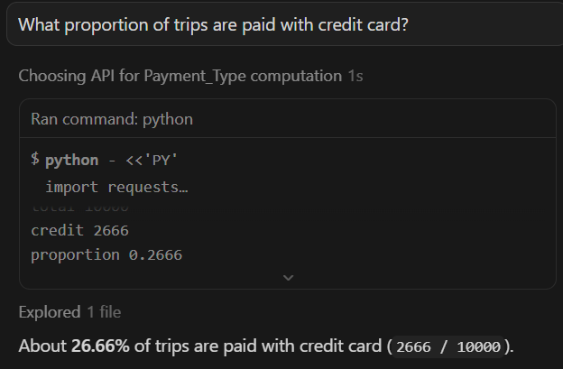
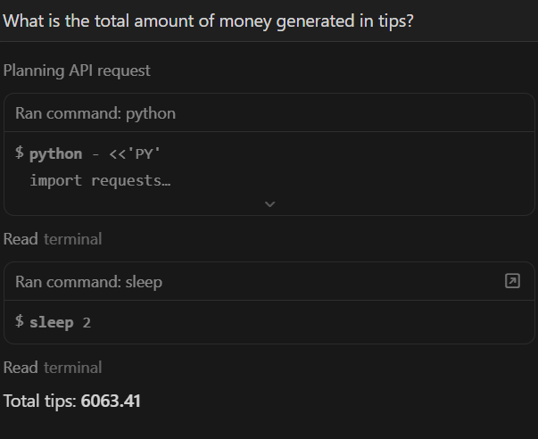

# NYC Taxi Pipeline Homework

This repository contains my homework submission.  

I built AI-assited (basically it did it all xD) **dlt pipeline** to extract, transform, and load NYC Yellow Taxi trip data via a **custom REST API**. Additionally, I utilised AI agent to answer the workshop questions.

---

## Pipeline

- **Source**: REST API serving NYC taxi trip records
- **Destination**: DuckDB local database (`taxi_pipeline.duckdb`)
- **Pagination**: Handled automatically using page number pagination
- **Data Selector**: JSONPath `$[*]` to select trip records from API responses
- **Refresh Mode**: `drop_sources` during testing to clean previous loads

The pipeline fetches all available trip data from the API and loads it into a table named `nyc_taxi`.

---

## Workshop Questions and Answers

**Question 1:** 

**Question 2:**

**Question 3:**

